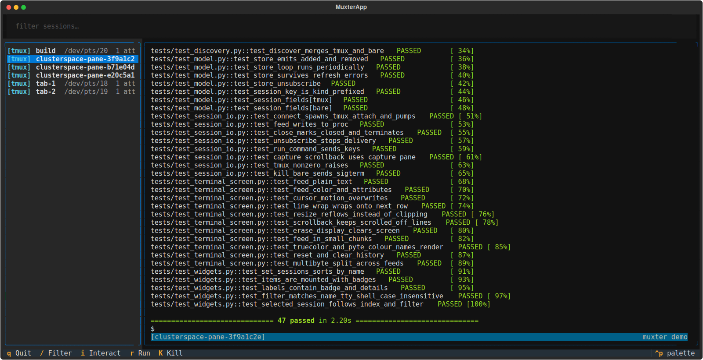
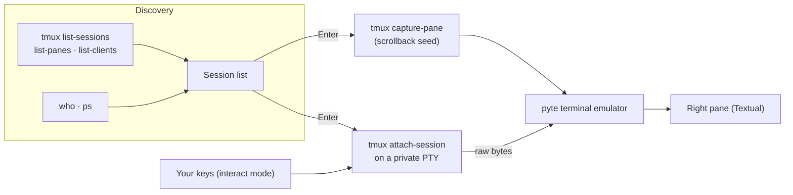

<div align="center">

# MuxTer

**Every tmux session on this machine, in one terminal, live.**

Browse your sessions on the left. Watch the selected one on the right: a real terminal
emulator, colour and all. Press `i` to type into it, and `Esc` to step back out.

[](https://www.python.org/)
[](https://textual.textualize.io/)
[](https://github.com/tmux/tmux)
[](#requirements)
[](https://github.com/mtecnic/clusterspace)



*MuxTer mirroring one of ClusterSpace's tmux sessions: the test run on the right is live, not a snapshot.*

</div>

---

## Why

`tmux ls` tells you which sessions exist. It doesn't tell you what any of them are doing.
Finding out means attaching to each one, looking, detaching, and doing it again. You can
only see one at a time, and a slip of the keyboard lands in the wrong shell.

MuxTer is the dashboard view:

- **See everything at once.** Every tmux session is listed with its tty and client count,
  and a filter narrows it down as you type. The list refreshes itself every few seconds.
- **Look without touching.** View mode is read-only. Selecting a session shows it live, so
  you can keep an eye on a long build or an agent without any risk of typing into it.
- **Step in when you mean to.** Press `i` and your keystrokes go to the session. `Esc`
  always brings you back out.
- **Nothing to install on the sessions.** MuxTer attaches as an ordinary tmux client.
  The sessions don't know or care that it's there.

## Built for ClusterSpace

> **If you run [ClusterSpace](https://github.com/mtecnic/clusterspace), MuxTer is the
> tool you want on the host.**

ClusterSpace wraps every SSH pane in a tmux session on the machine it connects to,
which is what makes its sessions survive disconnects and restarts. The flip side is
that those sessions are only *visible* from inside ClusterSpace's window.

MuxTer runs on that host and shows all of them in one terminal:

- **Check on your agent fleet from anywhere.** One plain `ssh` from a laptop, a phone
  SSH app or a tmux split gives you every ClusterSpace pane at once, with no Electron
  window needed.
- **Find a pane in a keystroke.** ClusterSpace names its sessions `clusterspace-pane-…`;
  type `/` then `clusterspace` and the list narrows to exactly those.
- **Watch without disturbing.** View mode never sends a byte, so an agent mid-task is
  never interrupted by you looking at it.
- **Steer when it's needed.** Press `i` to type into a stuck pane, or `r` to run a
  command in it, then `Esc` and move on to the next one.

The two are designed to work together: ClusterSpace keeps the sessions alive, and
MuxTer lets you see into all of them.

## Quick start

```bash
git clone https://github.com/mtecnic/muxter.git
cd muxter
uv sync
uv run muxter
```

To run it from anywhere, link the launcher onto your `PATH`:

```bash
ln -s "$PWD/muxter.sh" ~/.local/bin/muxter
muxter
```

`muxter.sh` resolves its own location through the symlink and checks that tmux is
installed. It runs through `uv` when that's available, and otherwise falls back to a
synced `.venv`.

### Requirements

- **Linux.** Discovery uses `who` and `ps`, and the terminal bridge uses a Linux PTY.
- **tmux 3.x** on your `PATH`.
- **Python 3.12+**, ideally managed by [uv](https://docs.astral.sh/uv/).

No root is needed. MuxTer runs as you and sees the tmux sessions you own.

## Using it

Select a session and press `Enter`. The right pane loads its recent scrollback and then
follows it live.

| Key | View mode |
| --- | --- |
| `j` / `k` | Move down / up the session list |
| `Enter` | Connect to the selected tmux session |
| `/` | Filter sessions by name, tty or shell |
| `i` | Switch to interact mode (needs a connected session) |
| `r` | Run a command in the connected session. It sends the filter box's text, or `ls` if the box is empty |
| `c` | Clear the right pane. This is local only, and the session is untouched |
| `K` | Kill the selected session, after a `y` / `n` confirmation |
| `q` | Quit |

| Key | Interact mode |
| --- | --- |
| Everything you type | Sent to the session, including `Ctrl` combinations (so your tmux prefix works), `Alt` combinations, arrows, `Home`/`End`, `PgUp`/`PgDn`, `Insert`/`Delete` and `F1`–`F12` |
| `Esc` | Back to view mode. `Esc` is never forwarded, so it always gets you out |
| `Ctrl+Q` | Quits muxter, even in interact mode |

The status bar above the key footer shows the current mode, the selected session's tty
and shell, and how long ago the list last changed. The right pane follows your window
size, and tmux reflows the session to match.

### What the list shows

- **`[tmux]`** entries are tmux sessions. These are the ones you can connect to.
- **`[bare]`** entries are logins with a plain shell and no tmux, such as an SSH session
  where you never started tmux. MuxTer can list them and `K` can end them, but it
  can't show them: a plain terminal's output goes only to its own window. A terminal that
  is just displaying a tmux session doesn't count as bare and isn't listed separately.

## How it works



- **tmux does the heavy lifting.** Connecting starts a real `tmux attach-session` client on
  a pseudo-terminal that MuxTer owns. MuxTer gets exactly what a terminal would get,
  including the full screen state, colour and cursor movement, with no scraping.
- **A real emulator renders it.** The byte stream goes through [pyte](https://github.com/selectel/pyte),
  a VT100/xterm emulator. MuxTer adds autowrap and full-width scrollback snapshots, which
  pyte lacks by default, and draws the result as a Textual widget with truecolour support.
- **History first, live on top.** Before attaching, MuxTer seeds the pane with
  `tmux capture-pane`, so you land on the session's recent output rather than an empty
  screen.
- **Discovery is plain Unix.** tmux lists its sessions, panes and clients, `who` lists
  logins, and `ps` supplies the shell names. Anything that is a tmux pane or a tmux client
  is accounted for, and whatever login is left over is a bare shell.
- **No locks.** Everything runs on one asyncio loop: a session store re-runs discovery
  every five seconds, and one reader task per connection feeds the screen.

## Limits

- **Bare sessions can be listed and killed, but not viewed.** A plain terminal's output
  goes only to its own window, and there is no tmux client to attach through.
- **`Esc` and `Ctrl+Q` belong to muxter.** A program that needs a bare `Esc`, such as
  vim, won't get one from interact mode. In vim, `Ctrl+C` also leaves insert mode.

## Development

```bash
uv sync                    # install, including dev tools
uv run pytest -q           # the test suite
uv run ruff check muxter tests
```

The tests replay real `tmux`, `who` and `ps` output recorded from a live machine
(`tests/fixtures/recorded.py`), feed raw terminal bytes through the real emulator, and
drive the Textual app headlessly. Nothing is mocked above the byte stream.

```
muxter/
  app.py              the Textual app: layout, keys, modes
  discovery.py        finds tmux sessions and bare logins
  session_io.py       the attach-session PTY bridge, send-keys, capture-pane
  terminal_screen.py  pyte-backed emulator and the widget that draws it
  widgets.py          the filterable session list
  model.py            Session and the session store
muxter.sh             launcher for running from anywhere
```

## Related

- **[ClusterSpace](https://github.com/mtecnic/clusterspace)**: a tiled desktop
  workspace for terminals, browsers, SSH+tmux sessions and AI agents. It creates the
  sessions, and MuxTer lets you watch them.
